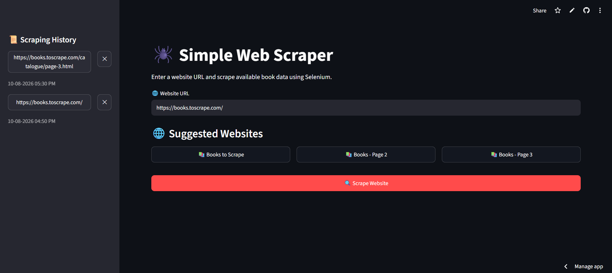
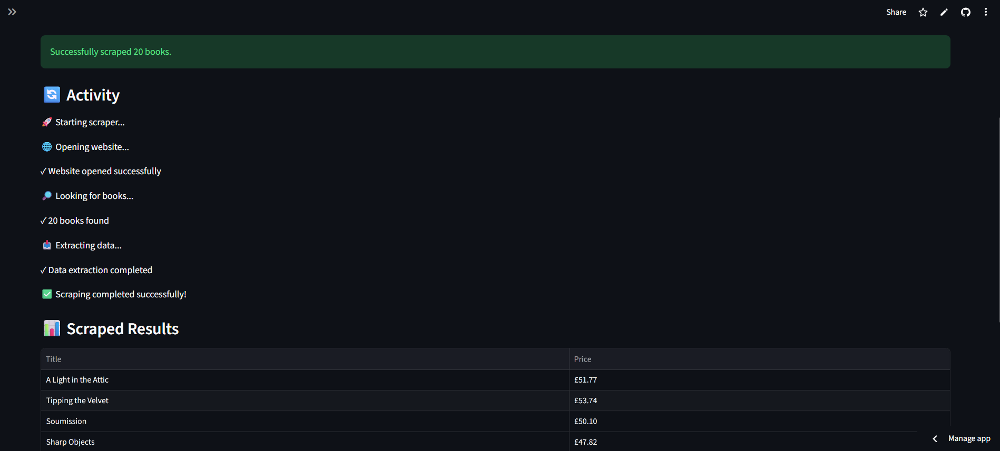
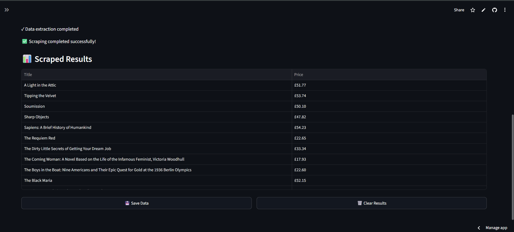

# 🕷️ Simple Web Scraper

A simple and user-friendly web scraping application built with **Python, Selenium, Pandas, and Streamlit**.

The application allows users to enter a website URL and extract book titles and prices using Selenium. The scraped data is displayed in a clean table and can be saved as a CSV file.

## 🚀 Live Demo

You can try the application online:

https://simple-web-scraper-moifiurzbyntcaxv7mwfgv.streamlit.app/

## ✨ Features

- 🌐 Enter any website URL
- 🔎 Scrape book data using Selenium
- 📚 Extract book titles
- 💰 Extract book prices
- 📊 Display scraped data in a table
- 💾 Save scraped data as CSV
- 🔄 Real-time scraping activity/status
- 🕘 Scraping history
- 📱 Works on desktop and mobile
- ☁️ Deployed using Streamlit

## 🛠️ Technologies Used

- Python
- Selenium
- Streamlit
- Pandas
- Chrome WebDriver

## 📸 Screenshots

### 🏠 Main Interface

The main interface allows users to enter a website URL and select from suggested websites.



### 🔄 Scraping Activity

The application displays the scraping process and shows the extracted book data.



### 📊 Scraped Results

The extracted book titles and prices are displayed in a table.



## ⚙️ How It Works

1. User enters a website URL.
2. Selenium opens the website.
3. The scraper searches for available book elements.
4. Book titles and prices are extracted.
5. The extracted data is stored in a Pandas DataFrame.
6. The results are displayed in the Streamlit interface.
7. Users can save the scraped data as a CSV file.

## 📁 Project Structure

```text
simple-web-scraper/
│
├── app.py
├── scraper.py
├── requirements.txt
├── packages.txt
├── README.md
├── .gitignore
│
└── screenshots/
    ├── main-interface.png
    ├── scraping-activity.png
    └── scraped-results.png
